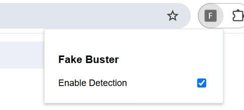
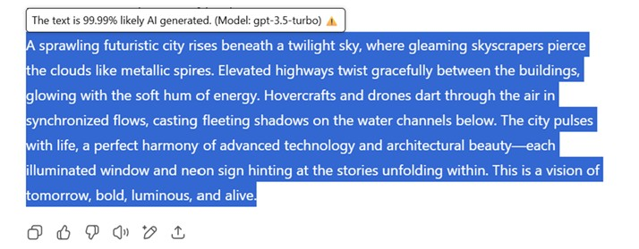

# 🏆 GirlHacks Hackathon 2025 Project– 3rd Place Winner

### 🧠 Fake Buster – Chrome Extension to Detect Deepfakes & AI-Generated Text  
👉 [View the source code on GitHub](https://github.com/PriyankaWani66/girlhacks-2025-fakebuster)


### 📌 Overview  
Fake Buster is a privacy-first Chrome extension designed to detect AI-generated images and text in real time as users browse the web. With seamless image scanning and right-click text detection, users are empowered with lightweight, non-intrusive alerts powered by state-of-the-art APIs.


### ✨ Key Features  
- 🔄 Real-Time Image Detection: Instantly flags AI-generated images as you scroll — no interaction required.  
- ✍️ Text Detection via Right-Click: Highlight and analyze suspicious content with just two clicks.  
- 🔕 Discreet Alerts: Clean UI shows detection results with confidence scores, without disrupting the browsing experience.  
- 🧩 Model-Agnostic Architecture: Easily integrate alternative detection APIs.  
- 🛡️ Strict Privacy Compliance:  
  - Detection is off by default  
  - No user data is collected or stored  


### 🗂️ Project Structure
```
Fake-Buster/
│
├── extension/                  # Chrome extension source code
│   ├── background.js
│   ├── content.js
│   ├── popup.html
│   ├── popup.js
│   └── manifest.json
│
├── prediction/                 # FastAPI backend
│   ├── main.py
│   ├── requirements.txt
│   ├── .env                    # Local environment variables (excluded from Git)
│
└── venv/                       # Optional virtual environment
```

### 🛠️ Setup Instructions

1️⃣ Clone the Repository
```bash
git clone https://github.com/PriyankaWani66/girlhacks-2025-fakebuster.git
```

2️⃣ Backend Setup (FastAPI)
Install dependencies:
```bash
cd prediction
pip install -r requirements.txt
```

Create a `.env` file in the `prediction/` directory:
```env
SIGHTENGINE_API_USER=your_user
SIGHTENGINE_API_SECRET=your_secret
```

Launch the API:
```bash
uvicorn main:app --reload
```

APIs available at:  
- `http://127.0.0.1:8000/detect-image`  
- `http://127.0.0.1:8000/detect-text`


3️⃣ Chrome Extension Setup
1. Open Chrome and navigate to `chrome://extensions/`  
2. Enable 'Developer mode' 
3. Click 'Load unpacked' and select the `/extension` directory  
4. The Fake Buster icon will appear in your Chrome toolbar


### 🚀 How It Works

- 🖼️ Image Detection: Scroll through any webpage — images are scanned automatically, and flagged deepfakes are labeled with tags like `⚠️ 93% likely AI`.  
- ✍️ Text Detection: Highlight suspicious text → right-click → “Check if AI-generated.”  
  - A confidence score is shown with a warning symbol (e.g., ⚠️ 10% likely AI).
  - If the score exceeds 80%, the likely LLM model is also displayed.

> Note: Detection is 'disabled by default' and must be enabled from the extension popup.


### 📸 Screenshots
- Extension popup with on/off toggle 



- Tag overlay on flagged images  

Example 1:


Example 2:


- Text detection result popup 

Example 1:


Example 2:

 

### 🧰 Tech Stack

| Layer       | Technologies Used                          |
|-------------|---------------------------------------------|
| Frontend    | HTML, CSS, JavaScript (Chrome Extension APIs) |
| Backend     | Python, FastAPI                             |
| AI Services | Sightengine (images), HuggingFace Inference (text) |


### 🔮 Future Enhancements  
- 🎥 Video deepfake detection  
- 📊 User history dashboard  
- 📱 Mobile browser support  
- 💻 On-device ML inference for offline detection  


### 👥 Team Fake Buster  
- Priyanka Pramod Wani – Student at Missouri S&T  
- Deeptika Kannan – Software Developer at Kiowa Corporation  
- Sai Sravani Sure – Student at University of Michigan  
- Nossaiba Kheiri – Student at Columbia University  

